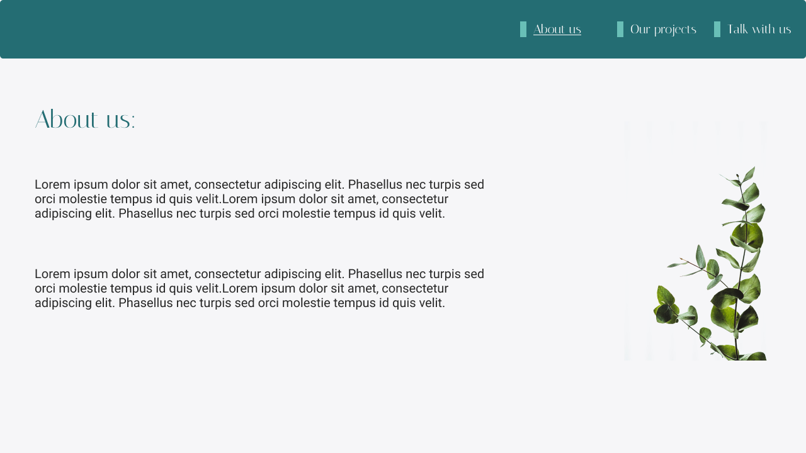

<h1 align="center"> Flower Garden </h1>

 

  <a href="#-tecnologias">Tecnologias</a>&nbsp;&nbsp;&nbsp;|&nbsp;&nbsp;&nbsp;
  <a href="#-descrição">Descrição</a>&nbsp;&nbsp;&nbsp;|&nbsp;&nbsp;&nbsp;
  <a href="#-confira-o-projeto">Confira o projeto</a>&nbsp;&nbsp;&nbsp;|&nbsp;&nbsp;&nbsp;
  <a href="#memo-licença">Licença</a>

  

## 🚀 Tecnologias

Esse projeto foi desenvolvido com as seguintes tecnologias:

- HTML
- CSS
- Figma
- Git e Github
---
 

## 💻 Descrição

Projeto independente que mostra uma página de uma floricultura, com breves demonstrações de alguns produtos, uma introdução da empresa e um formulário para contato.  
O intuito desse projeto foi desenvolver uma página com o uso do **Display grid** no CSS; **responsividade** de elementos; tags **semânticas** de HTML; **animações** em CSS, e **manipulação de imagens** com CSS. 

  

 

## Acesse o projeto!

[FlowerGarden.com] (https://eduvieira131.github.io/Flower-garden/)

---
 

## :memo: Licença

Esse projeto está sob a licença MIT.

---
